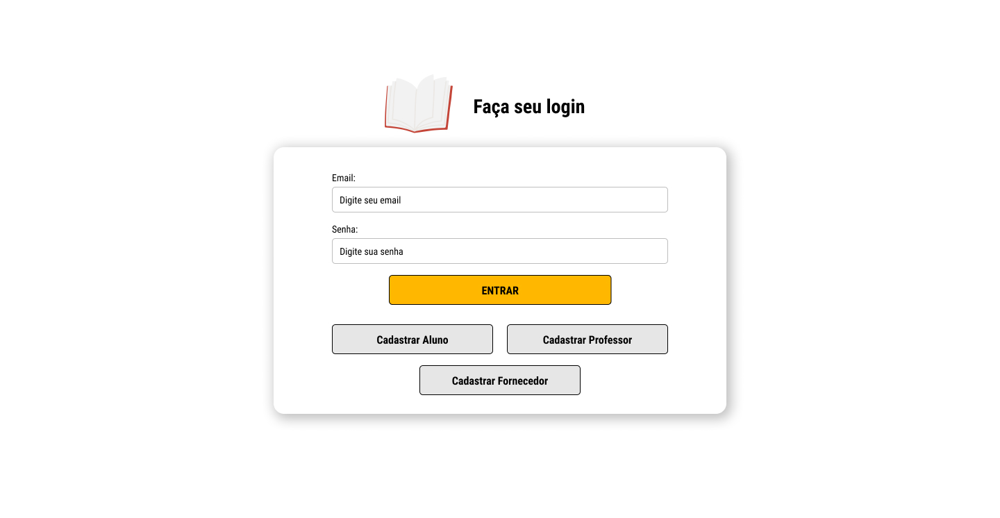
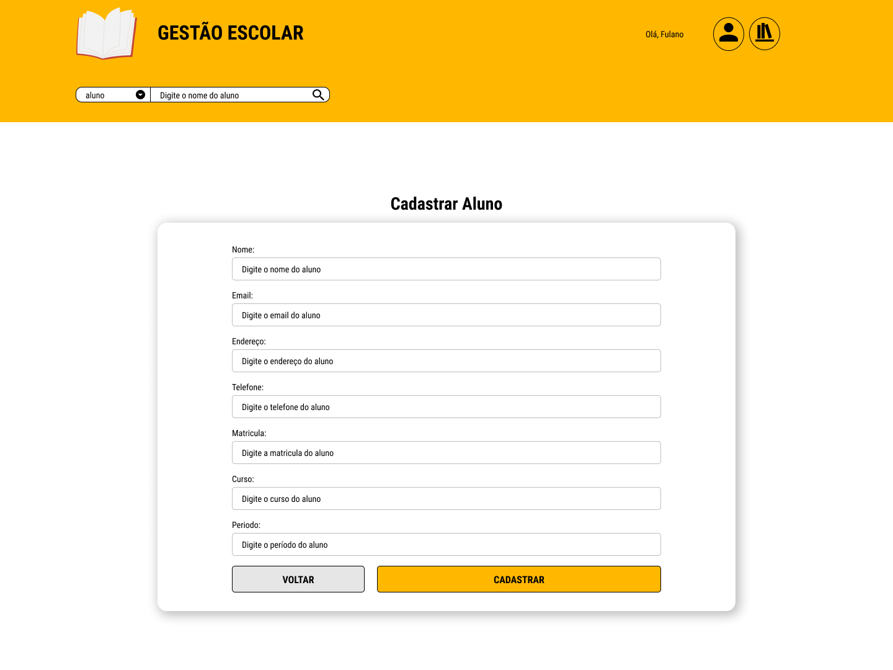
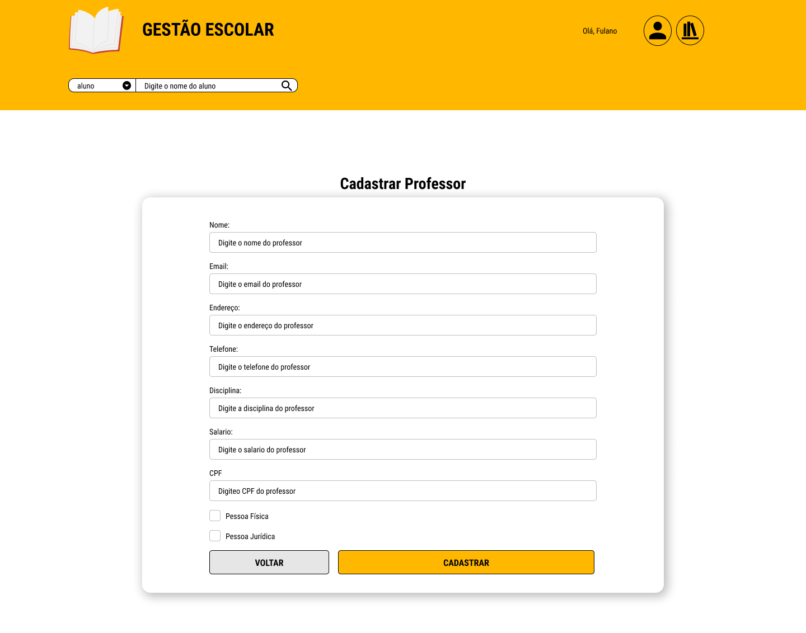
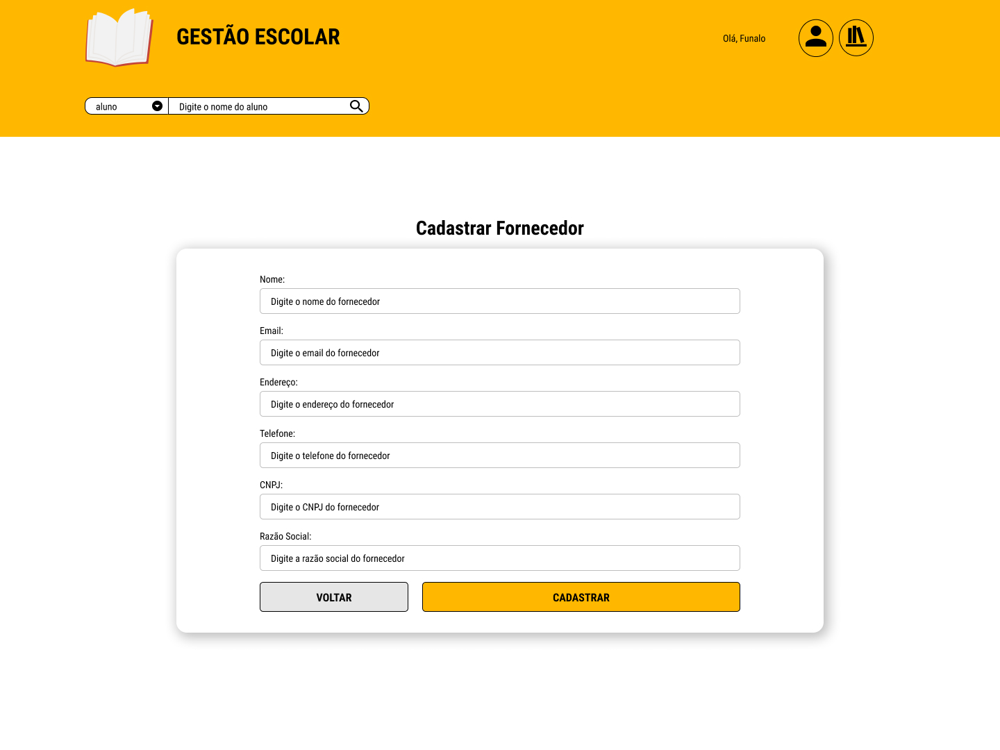

# Sistema de Gestão Escolar

# Problema de Negócio:

Desenvolver os protótipos da interface com base em um sistema de gestão escolar, de acordo com o diagrama de caso de uso que foram desenvolvidos na primeira fase do projeto.

***Link para entendimento do projeto: <a href="https://github.com/SenacGrupo-7/Projeto_Integrador/blob/main/Proposta.md" target="_blank">Proposta</a>***

## Funcionalidades do Sistema:

Pessoa Física e Pessoa Jurídica.

***- Aluno [Acessar Material de Estudo; Calendário Escolar; Gerar Relatórios]***

***- Professor [Lançar Notas; Matricular Aluno; Visualizar boletins]***

***- Fornecedor [Fornecer materias e serviços; emitir NF/faturamento de pedidos]***

## MER:

Modelo lógico por associação:

# Prototipação:

## TELA DE LOGIN

## TELA CADASTRAR ALUNO

## TELA CADASTRAR PROFESSOR

## TELA CADASTRAR FORNECEDOR

# Conclusão:

Em conclusão, a implementação deste sistema baseado na web representa não apenas a realização de um projeto, mas a concretização de uma visão voltada para a inovação. Ao longo deste processo, alcançamos não apenas os objetivos iniciais, mas também criamos um ambiente online e centrado no usuário.

Este projeto não é apenas um marco, mas um ponto de partida para futuras evoluções e aprimoramentos, à medida que continuamos a atender às necessidades dinâmicas do cenário digital em constante mudança.

# Melhorias Futuras:

* Desenvolver a conexão do BackEnd junto ao banco de dados
