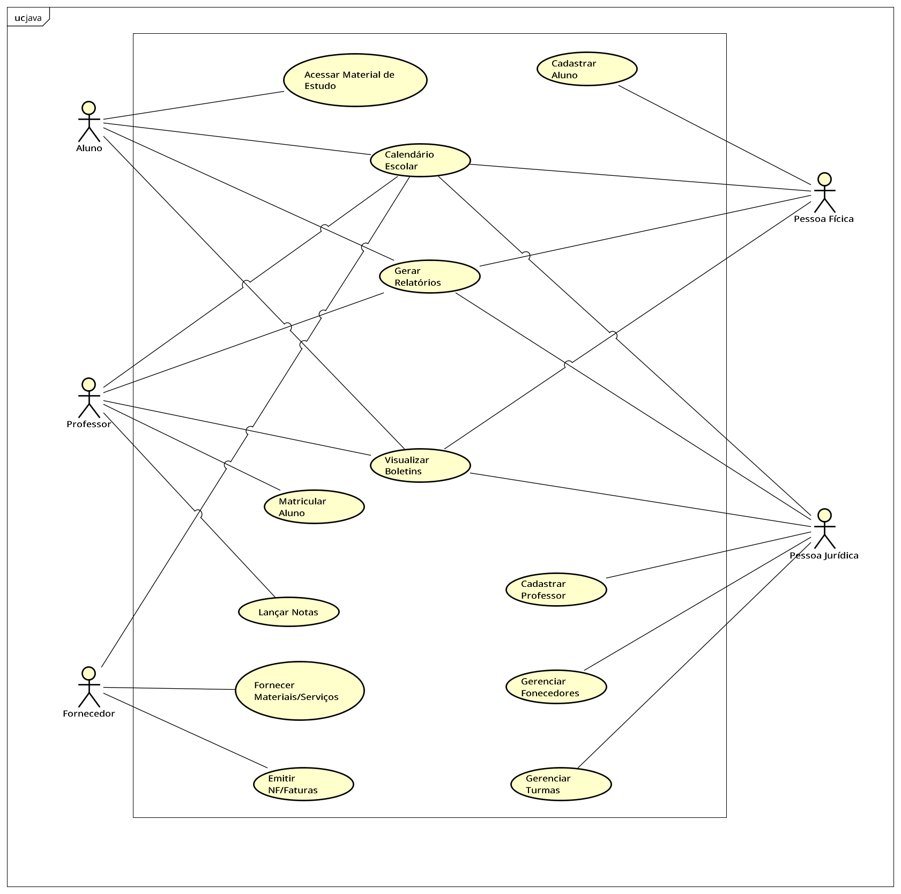
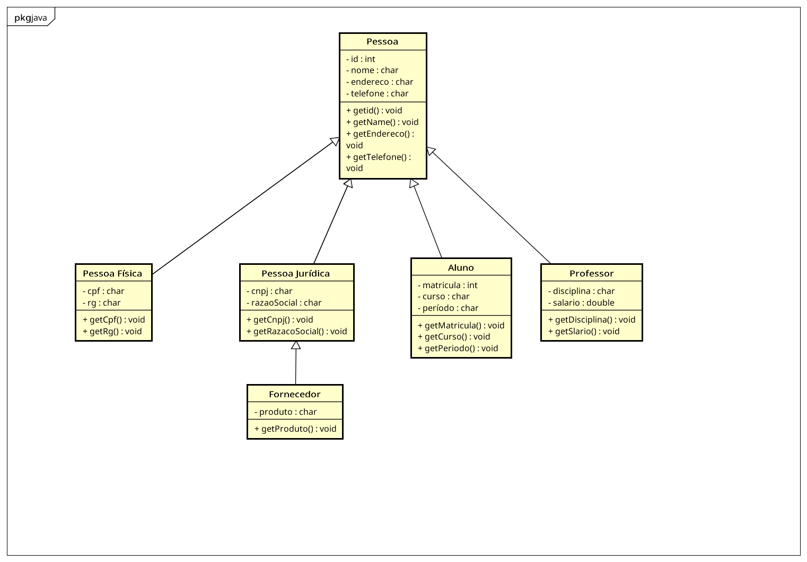

# Sistema de Gestão Escolar

# Problema de Negócio:

Desenvolver os protótipos da interface com base em um sistema de gestão escolar, de acordo com o diagrama de caso de uso que foram desenvolvidos na primeira fase do projeto.

***Link para entendimento do projeto: <a href="https://github.com/SenacGrupo-7/Projeto_Integrador/blob/main/Proposta.md" target="_blank">Proposta</a>***

## Funcionalidades do Sistema:

Pessoa Física e Pessoa Jurídica.

***- Aluno [Acessar Material de Estudo; Calendário Escolar; Gerar Relatórios]***

***- Professor [Lançar Notas; Matricular Aluno; Visualizar boletins]***

***- Fornecedor [Fornecer materias e serviços; emitir NF/faturamento de pedidos]***

## MER:

Modelo lógico por associação:

# Conclusão:

